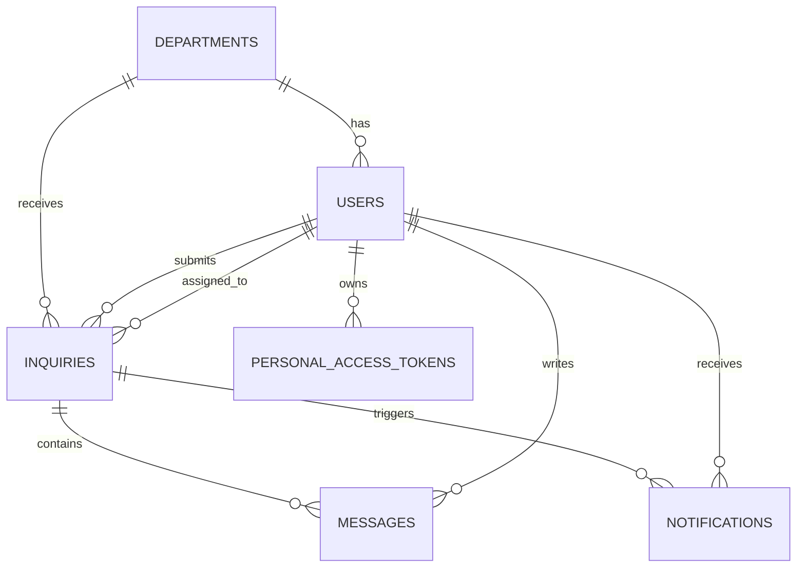
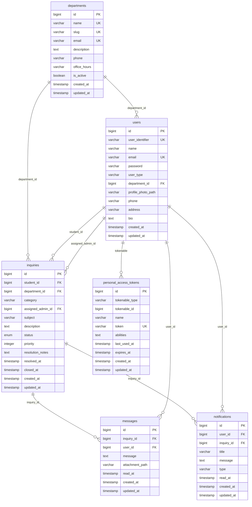

# Inquiry System ERD

## Logical ERD

## Physical ERD

## API Coverage

- `POST /api/login`, `POST /api/register`, `POST /api/logout`, `GET /api/me`
- `GET /api/dashboard`
- `GET /api/departments`
- `GET /api/inquiries`
- `POST /api/inquiries`
- `GET /api/inquiries/{inquiry}`
- `PUT /api/inquiries/{inquiry}`
- `DELETE /api/inquiries/{inquiry}`
- `PUT /api/profile`
